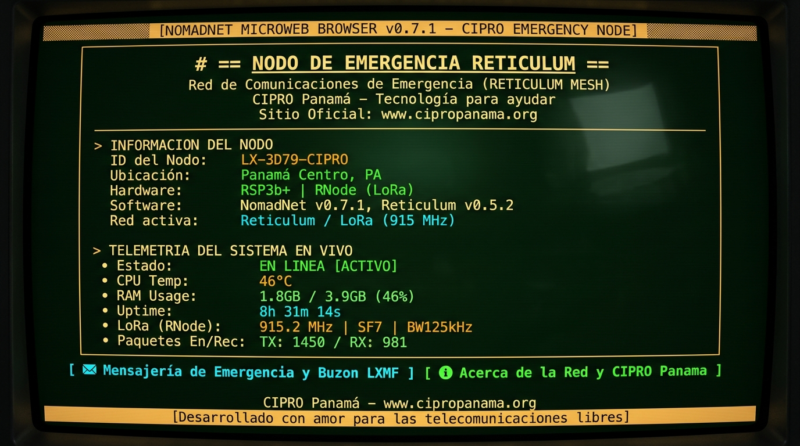

# 📡 CIPRO Reticulum Emergency Node (`Node-reticulum`)

> Despliegue automático de nodos de malla, transporte y mensajería de emergencia sobre **Reticulum Network Stack (RNS)** y **NomadNet** para microcomputadoras de bajo costo (Raspberry Pi Zero W / 2W, Orange Pi Zero, MangoPi MQ-Pro).

---

## 🆘 ¿Por qué existe este proyecto?

Cuando ocurre una catástrofe natural (huracán, terremoto, inundación) o un corte masivo de energía eléctrica, la infraestructura tradicional de telefonía celular e internet suele ser lo primero en caer. En esas primeras horas y días, **estar incomunicado cuesta vidas**.

Este proyecto nace con un propósito claro y práctico: permitir que cualquier voluntario, radioaficionado o comunidad monte un **nodo repetidor y servidor de mensajería de emergencia completamente autónomo** en cuestión de minutos, usando placas muy económicas (desde $15 USD como una Raspberry Pi Zero, Orange Pi o MangoPi) y módulos de radio LoRa o módems analógicos.

El sistema se encarga de todo el trabajo técnico de fondo: instala Reticulum, activa el enrutamiento de la malla, habilita un buzón para guardar mensajes a personas desconectadas, levanta una página informativa en la red NomadNet con el estado del equipo y vigila el sistema con un perro guardián (*watchdog*) para que no se cuelgue si queda instalado en lo alto de un cerro o una torre.

Este desarrollo es una iniciativa abierta auspiciada por **[Cipropanama.org](https://www.cipropanama.org)**, como parte de nuestro ecosistema de telecomunicaciones libres y de emergencia (junto a herramientas como **[SMTP-Reticulum](https://github.com/cipropanama/SMTP-Reticulum)**).

---

## ⚡ Instalación en 1 Solo Paso

Enciende tu Raspberry Pi, Orange Pi o MangoPi con conexión a Internet y corre este comando en la terminal:

```bash
curl -sSL https://raw.githubusercontent.com/cipropanama/Node-reticulum/main/install.sh | sudo bash
```

O si prefieres clonar el repositorio:

```bash
git clone https://github.com/cipropanama/Node-reticulum.git
cd Node-reticulum
sudo bash install.sh
```

El instalador detecta automáticamente el hardware (ARMv6, ARMv7, ARM64 o RISC-V), instala las dependencias de Python y Reticulum, configura los servicios de arranque automático y lanza un asistente gráfico interactivo muy sencillo para dejar el nodo listo.

---

## 🧭 ¿Qué hace el nodo una vez instalado?

```
 [Usuario con LoRa/Sideband]
             │ (Mensaje a vecino desconectado)
             ▼
 ╔═════════════════════════════════════════════════════════════════════╗
 ║         📡 NODO DE EMERGENCIA RETICULUM (SBC + RNODE)               ║
 ║                                                                     ║
 ║  • Enrutador de Malla (Transporte Activo de Paquetes)               ║
 ║  • Almacén Store-and-Forward (Guarda el mensaje cifrado)           ║
 ║  • Página NomadNet (Telemetría en vivo + Info Cipropanama.org)     ║
 ║  • Watchdog Autoreparador (Evita bloqueos y reinicia si falla)      ║
 ╚═════════════════════════════════════════════════════════════════════╝
             │ (El vecino vuelve a encender su radio o pasa cerca)
             ▼
 [Vecino recibe su mensaje automáticamente]
```

1. **Repetidor de Malla (Transport Router):** Extiende el alcance de la red retransmitiendo paquetes cifrados entre otros usuarios de la zona sin necesidad de internet.
2. **Buzón en Diferido (*Store-and-Forward* LXMF):** Si envías un mensaje a alguien que tiene su radio apagada o está fuera de cobertura, este nodo lo guarda de forma segura en su memoria y se lo entrega automáticamente apenas el destinatario vuelva a aparecer en la malla.
3. **Página Microweb en NomadNet:** El nodo publica en la red una página local accesible desde NomadNet/Sideband donde muestra el nombre del nodo, estado de la CPU, temperatura, memoria, tiempo encendido, canales de auxilio y enlaces oficiales de **[Cipropanama.org](https://www.cipropanama.org)**.

<p align="center">
  
  <br>
  <em>Vista de la página del Nodo de Emergencia visualizada desde el navegador Microweb de NomadNet.</em>
</p>

4. **Perro Guardián (*Watchdog*):** Los nodos en sitios remotos no pueden irse a reiniciar a mano. Un script en segundo plano supervisa que los servicios sigan vivos, limpia la memoria RAM si se satura, vigila que el módem USB no se desconecte por bajas de voltaje y hace un reinicio preventivo si ocurre un bloqueo severo.
5. **🏓 Bot de Eco y Prueba de Cobertura LXMF:** Respondedor automático pasivo para que brigadistas y voluntarios en campo envíen `ping` o `test` y reciban confirmación inmediata de alcance, hora y telemetría.
6. **🔋 Monitor de Batería Solar (I2C / INA219):** Medición de voltaje y nivel de batería LiFePO4 / 12V integrado en la telemetría de NomadNet para supervisar energía a distancia.
7. **🌙 Perfil de Ahorro Extremo (Low-Power Tuning):** Reduce entre 20mA y 80mA de consumo continuo apagando la salida HDMI, los LEDs parpadeantes del SBC y el chip Bluetooth innecesario.
8. **📱 Emparejamiento Rápido por Código QR:** Muestra en la terminal un código QR en caracteres ASCII para escanear con la app **Sideband** móvil y vincularse con el nodo en 1 segundo.

---

## 🛠️ Panel de Control del Operador (`rns-admin`)

Para cambiar la configuración (frecuencia LoRa, nombre del nodo, enlaces de internet) o revisar cómo está funcionando el equipo, solo escribe en tu terminal:

```bash
sudo rns-admin
```

Te aparecerá un menú directo con las siguientes opciones:

- **[1] 📊 Ver Estado y Telemetría:** Muestra `rnstatus`, interfaces de radio conectadas, memoria, temperatura y paquetes cursados.
- **[2] ⚙️ Reconfigurar el Nodo:** Asistente paso a paso para cambiar el nombre, ubicación, parámetros LoRa (915 MHz, 868 MHz, 433 MHz, potencia, ancho de banda), módems serie o servidores TCP.
- **[3] 📱 Mostrar Código QR de Conexión Rápida:** Genera el QR en consola para escanear con la app Sideband móvil.
- **[4] 🔋 Monitor de Batería Solar:** Consulta el voltaje real de la batería y nivel de carga.
- **[5] 🌙 Perfil de Ahorro de Energía:** Activa o desactiva el apagado de HDMI y LEDs de estado.
- **[6] 📜 Ver Registros en Vivo:** Consulta qué está pasando en Reticulum, NomadNet o el Watchdog.
- **[7] 🛠️ Gestión de Servicios:** Reiniciar, detener o arrancar la red.
- **[8] 💾 Copias de Seguridad:** Crea o restaura un respaldo de tus claves criptográficas e identidades en un archivo `.tar.gz`.
- **[9] 🔄 Actualizar Software:** Descarga las últimas mejoras del repositorio en GitHub con un solo clic.

---

## 📻 Hardware Soportado

| Componente | Opciones Recomendadas | Notas |
| :--- | :--- | :--- |
| **SBC (Cerebro)** | Raspberry Pi Zero W / Zero 2W, Orange Pi Zero / Zero 3, MangoPi MQ-Pro (RISC-V) | Bajo consumo (1W a 3W), ideal para batería o panel solar |
| **Radio LoRa (RNode)** | LilyGO T-Beam, T-Echo, Heltec LoRa32 v3, RNode DIY (SX1262 / SX1276) | Conexión directa por cable USB o por pines GPIO UART |
| **Sensor de Batería** | Módulo INA219 (I2C) | Medición de 0-26V de batería solar/LiFePO4 |
| **Módem Packet** | TNC KISS por USB / Serie | Compatible con equipos VHF/UHF de radioaficionados |
| **Alimentación** | Fuente 5V 2A o sistema solar 12V con conversor Step-Down | Para evitar micro-cortes en transmisión LoRa |

> 📖 Consulta diagramas de pines, UART y conexión del sensor INA219 en la [Guía de Hardware y Pinouts](docs/HARDWARE_PINOUTS.md).

---

## 🌐 Ecosistema de Proyectos CIPRO Panamá

CIPRO impulsa un conjunto de herramientas libres y complementarias sobre Reticulum para crear redes de comunicación de emergencia robustas:

- 📡 **[Node-reticulum](https://github.com/cipropanama/Node-reticulum)** — Auto-instalador y gestor de nodos de emergencia para SBCs con Store & Forward y NomadNet.
- 📧 **[SMTP-Reticulum](https://github.com/cipropanama/SMTP-Reticulum)** — Pasarela de correo táctico sobre Reticulum con salida a Internet (SMTP/IMAP).
- 📊 **[MQTT-Reticulum](https://github.com/cipropanama/MQTT-Reticulum)** — Pasarela y transporte de telemetría / IoT sobre Reticulum.
- 📻 **[APRS-Reticulum](https://github.com/cipropanama/APRS-Reticulum)** — Integración y pasarela de tramas APRS de radioaficionados sobre Reticulum.

---

## 🤝 Comunidad y Licencia

Este proyecto está liberado bajo la licencia **MIT**. Su uso es totalmente libre para fines experimentales, respuesta a emergencias y proyectos comunitarios solidarios.

Si este desarrollo te ha sido útil, te invitamos a mantener el reconocimiento y el enlace hacia el proyecto original.

### Contacto CIPRO Panamá

- 🌐 **Sitio Web:** [www.cipropanama.org](https://www.cipropanama.org/)
- ✉️ **Correo Electrónico:** [info@cipropanama.org](mailto:info@cipropanama.org)
- 🐙 **GitHub:** [github.com/cipropanama](https://github.com/cipropanama)

> **CIPRO Panamá** — _Tecnología para ayudar._  
> Desarrollado con ❤️ para las telecomunicaciones libres.
