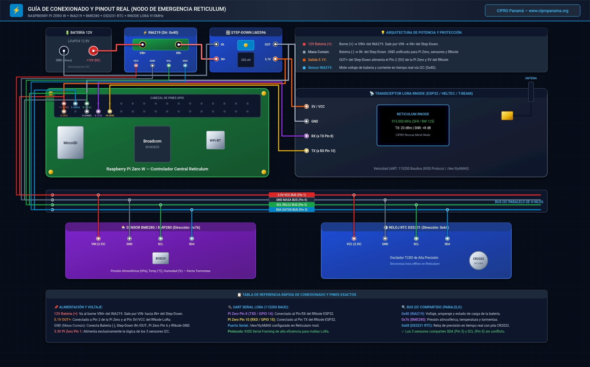

# Guía de Conexión de Hardware y Pinouts (SBC a RNode LoRa)

**CIPRO Panamá — Tecnología para ayudar**  
[www.cipropanama.org](https://www.cipropanama.org/)

---

## 1. Conexión Vía USB (Recomendada y Plug & Play)

Para la mayoría de los despliegues, el método más robusto y sencillo es utilizar un dispositivo RNode conectado por puerto USB:
- **Dispositivos soportados:** LilyGO T-Beam, T-Echo, Heltec LoRa32 v3, RNode DIY basado en ESP32/nRF52.
- **Detección:** Se reconocen automáticamente como `/dev/ttyUSB0` o `/dev/ttyACM0`.
- **Alimentación:** En Raspberry Pi Zero W y MangoPi MQ-Pro, utilice un cable adaptador Micro-USB OTG a USB-A Hembra o USB-C según corresponda.

---

## 2. Conexión Directa por Cabecera de Pines (UART / Header)

Si se conecta un módulo transceptor LoRa UART directo (o microcontrolador RNode a pines GPIO):

### A. Raspberry Pi Zero W / 2W (Header de 40 Pines)
| Señal SBC | Pin Físico | Pin RNode / Módulo | Descripción |
| :--- | :--- | :--- | :--- |
| **5V / 3.3V** | Pin 2 (5V) o Pin 1 (3.3V) | VCC | Alimentación |
| **GND** | Pin 6 / 9 / 14 | GND | Tierra común |
| **TXD (GPIO 14)** | Pin 8 | RX | Transmisión de datos |
| **RXD (GPIO 15)** | Pin 10 | TX | Recepción de datos |

> **Nota para Raspberry Pi:** Habilite el puerto serie UART desactivando la consola serial en `raspi-config` -> `Interface Options` -> `Serial Port`. El puerto será `/dev/serial0` o `/dev/ttyAMA0`.

---

### B. Orange Pi Zero / Zero 3 (Header UART)
| Señal Orange Pi | Header UART | Pin RNode |
| :--- | :--- | :--- |
| **VCC (5V / 3.3V)** | Pin 1 | VCC |
| **GND** | Pin 2 | GND |
| **TX (UART1 / UART5)**| Pin 3 | RX |
| **RX (UART1 / UART5)**| Pin 4 | TX |

---

### C. MangoPi MQ-Pro (Allwinner D1 RISC-V)
| Señal MangoPi | Pin Físico | Pin RNode |
| :--- | :--- | :--- |
| **3.3V** | Pin 1 | VCC |
| **GND** | Pin 6 | GND |
| **UART0 / UART3 TX** | Pin 8 | RX |
| **UART0 / UART3 RX** | Pin 10 | TX |

---

---

## 3. Conexión de Módulos I2C en Paralelo (Batería INA219, Clima BME280 y Reloj RTC DS3231)

Los módulos **INA219** (monitor de batería solar), **BME280/BMP280** (barómetro y clima) y **DS3231** (reloj en tiempo real RTC para sincronización offline) funcionan simultáneamente conectados **en paralelo al mismo bus I2C (Pines 1, 3, 5 y 6)** del microcomputador sin interferencias.

<p align="center">
  
  <br>
  <em>Diagrama de conexión completo: Batería Solar 12V, Regulador Step-Down 5V, Raspberry Pi Zero W, Radio LoRa RNode y los 3 módulos I2C en paralelo (INA219 0x40, BME280 0x76 y RTC DS3231 0x68).</em>
</p>

### A. Pines Lógicos I2C (Hacia el SBC para INA219, BME280 y RTC DS3231)

Conecta los 4 pines de control del módulo INA219 a los pines GPIO de tu microcomputador:

| Pin INA219 | Raspberry Pi Zero W / 2W | Orange Pi Zero / Zero 3 | MangoPi MQ-Pro (D1) | Descripción |
| :--- | :--- | :--- | :--- | :--- |
| **VCC** | Pin 1 (3.3V) | Pin 1 (3.3V) | Pin 1 (3.3V) | Alimentación lógica del sensor |
| **GND** | Pin 6 / 9 / 14 (GND) | Pin 2 / 8 (GND) | Pin 6 (GND) | Tierra común |
| **SDA** | Pin 3 (GPIO 2 / I2C1_SDA) | Pin 3 (I2C0_SDA) | Pin 3 (TWI2_SDA) | Línea de datos I2C |
| **SCL** | Pin 5 (GPIO 3 / I2C1_SCL) | Pin 5 (I2C0_SCL) | Pin 5 (TWI2_SCL) | Línea de reloj I2C |

---

### B. Conexión de Medición de Potencia (Batería y Carga)

El sensor mide la corriente y voltaje en el lado positivo (*High-Side*):

```
                       [ + ] Borne Positivo Batería (12V)
                               │
                               ▼
                       ┌───────────────┐
                       │  Pin VIN +    │ (Módulo INA219)
                       │               │
                       │  Pin VIN -    │
                       └───────┬───────┘
                               │
                               ▼
              [ + Entrada ] Conversor Step-Down DC-DC (12V a 5.1V)
                               │
                               ▼
                     [ 5V ] Microcomputador SBC / RNode
```

- **`VIN +`**: Conectar directo al polo positivo (+) de la batería de 12V o LiFePO4.
- **`VIN -`**: Conectar a la entrada positiva (+) del regulador/conversor reductor (Step-Down) que alimenta al SBC.
- **`GND`**: Debe estar unido a la tierra común (GND) del sistema.

---

### C. Habilitación del Bus I2C en el Sistema Operativo

1. **En Raspberry Pi OS:**
   ```bash
   sudo raspi-config
   # Seleccionar: Interface Options -> I2C -> Enable -> Yes
   ```
   *O agregando `dtparam=i2c_arm=on` en `/boot/config.txt` (o `/boot/firmware/config.txt`).*

2. **En Armbian (Orange Pi):**
   ```bash
   sudo armbian-config
   # Seleccionar: System -> Hardware -> Marcar 'i2c0' o 'i2c1' -> Guardar
   ```

3. **Verificar detección del sensor en terminal:**
   ```bash
   sudo i2cdetect -y 1
   ```
   *(En Orange Pi Zero puede ser `i2cdetect -y 0`)*.  
   Deberás ver el número **`40`** en la matriz (dirección I2C `0x40`).

Una vez detectado, el sistema Reticulum Emergency Node comenzará a reportar el voltaje de la batería automáticamente en `sudo rns-admin`, en NomadNet y en las respuestas del bot de eco.

---

## 4. Conexión del Sensor Barométrico y Ambiental BME280 / BMP280 (I2C)

El sensor **BME280** (o **BMP280**) mide la presión barométrica (hPa), temperatura y humedad ambiental. Es ideal para alertar sobre la aproximación de tormentas o frentes de baja presión en sitios remotos.

### A. Pines y Conexión en Paralelo I2C

Dado que el protocolo **I2C es un bus compartido por direcciones**, puedes conectar el sensor BME280/BMP280 **en paralelo exactamente a los mismos 4 pines GPIO** donde se conecta el sensor de batería INA219, sin interferencias:

| Pin Sensor BME280 | Raspberry Pi Zero W / 2W | Orange Pi Zero / Zero 3 | MangoPi MQ-Pro (D1) | Descripción |
| :--- | :--- | :--- | :--- | :--- |
| **VCC / VIN** | Pin 1 o 17 (3.3V) | Pin 1 (3.3V) | Pin 1 (3.3V) | Alimentación lógica 3.3V (¡No conectar a 5V!) |
| **GND** | Pin 6 / 9 / 14 / 20 (GND) | Pin 2 / 8 (GND) | Pin 6 (GND) | Tierra común |
| **SDA / SDI** | Pin 3 (GPIO 2 / I2C1_SDA) | Pin 3 (I2C0_SDA) | Pin 3 (TWI2_SDA) | Línea de datos (en paralelo con INA219) |
| **SCL / SCK** | Pin 5 (GPIO 3 / I2C1_SCL) | Pin 5 (I2C0_SCL) | Pin 5 (TWI2_SCL) | Línea de reloj (en paralelo con INA219) |

```
                       ┌──────────────────────────────┐
                       │  Microcomputador SBC (GPIO)  │
                       │   [3.3V]  [GND]  [SDA]  [SCL]│
                       └─────┬───────┬──────┬──────┬──┘
                             │       │      │      │  (Bus I2C Compartido)
              ┌──────────────┴───────┼──────┴──────┼───────────────────────────┐
              │                      │             │                           │
              ▼                      ▼             ▼                           ▼
      ┌───────────────┐      ┌───────────────┐                    ┌─────────────────┐
      │ Módulo INA219 │      │ Módulo BME280 │                    │ Módulo RTC I2C  │
      │  (Dir: 0x40)  │      │(Dir: 0x76/0x77│                    │ DS3231 / DS1307 │
      │Batería / Solar│      │Presión y Clima│                    │   (Dir: 0x68)   │
      └───────────────┘      └───────────────┘                    └─────────────────┘
```

---

### B. Verificación de los Sensores y Reloj RTC en el Bus

Ejecuta en la terminal:
```bash
sudo i2cdetect -y 1
```

En la matriz verás las 3 direcciones I2C activas de forma concurrente:
- **`40`**: Sensor de Batería Solar INA219.
- **`68`**: Reloj en tiempo real por hardware RTC DS3231 (Sincronización de hora offline).
- **`76`** o **`77`**: Sensor barométrico y ambiental BME280 / BMP280.

---

## 5. Conexión de Módulo GPS (Opcional - Sincronización UTC y Coordenadas)

Para nodos móviles o vehiculares, se puede conectar un receptor GPS (u-blox NEO-6M / Quectel):
- **Por USB:** Plug & Play en `/dev/ttyUSB1` o `/dev/ttyACM0`.
- **Por UART:** Conectar `TX_GPS` a `RX_SBC`, `VCC` a `3.3V/5V` y `GND` a `GND`.
- El servicio `rns-timesync` sincroniza la hora UTC con los satélites y guarda las coordenadas en `/etc/reticulum-node/gps.json` automáticamente.

---

## 6. Recomendaciones de Energía para Despliegues Remotos

1. **Protección contra bajadas de tensión (Brownout):** Los transmisores LoRa pueden tener picos de consumo durante la transmisión. Coloque un condensador electrolítico de `100uF - 470uF` entre VCC y GND del transceptor si observa reinicios espontáneos.
2. **Sistema de Respaldo Solar:** Panel solar de 20W - 30W con controlador PWM/MPPT y batería LiFePO4 de 12V con conversor reductor (Step-down) de alta eficiencia ajustado a 5.15V.
3. **Guía de Dimensionamiento:** Para tablas completas de consumo por SBC, horas de sol pico (HSP), comparativas de baterías y kits recomendados, consulta la [Guía de Dimensionamiento Energético y Solar](DIMENSIONAMIENTO_SOLAR_ENERGIA.md).
4. **Watchdog de Hardware:** El instalador configura el script `watchdog.py` que monitorea periódicamente la estabilidad del sistema y los daemons para evitar cuelgues desatendidos.

---

## 🤝 Comunidad y Licencia

Este proyecto está liberado bajo la licencia **MIT**. Su uso es totalmente libre para fines experimentales, respuesta a emergencias y proyectos comunitarios solidarios.

Si este desarrollo te ha sido útil, te invitamos a mantener el reconocimiento y el enlace hacia el proyecto original.

### Contacto CIPRO Panamá

- 🌐 **Sitio Web:** [www.cipropanama.org](https://www.cipropanama.org/)
- ✉️ **Correo Electrónico:** [info@cipropanama.org](mailto:info@cipropanama.org)

> **CIPRO Panamá** — _Tecnología para ayudar._  
> Desarrollado con ❤️ para las telecomunicaciones libres.
